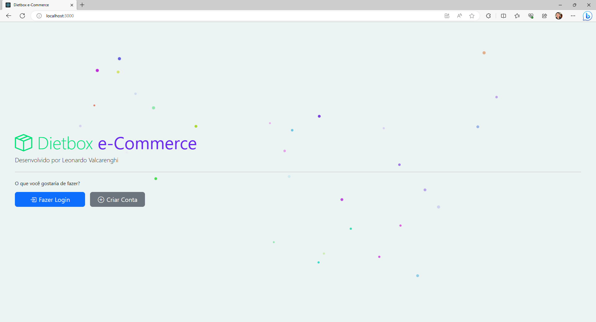
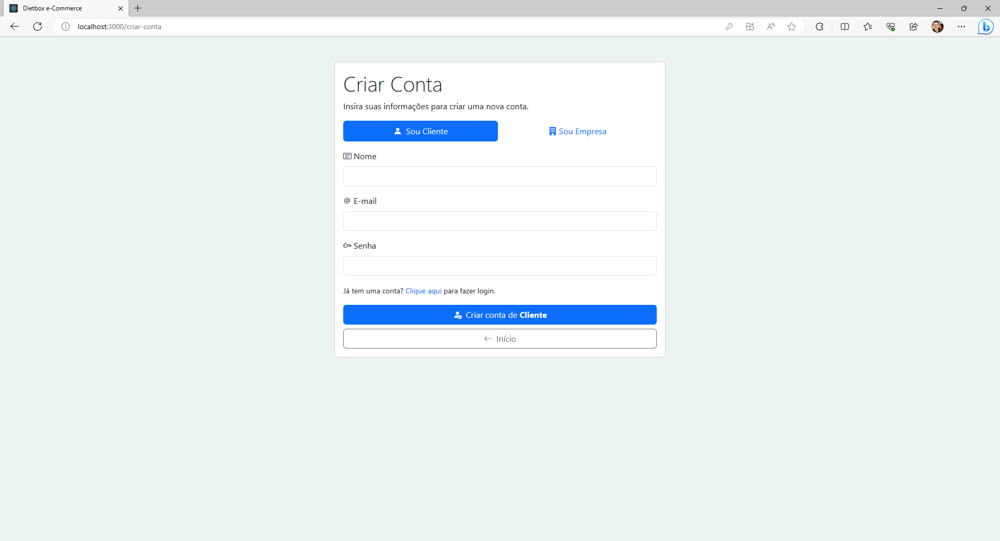
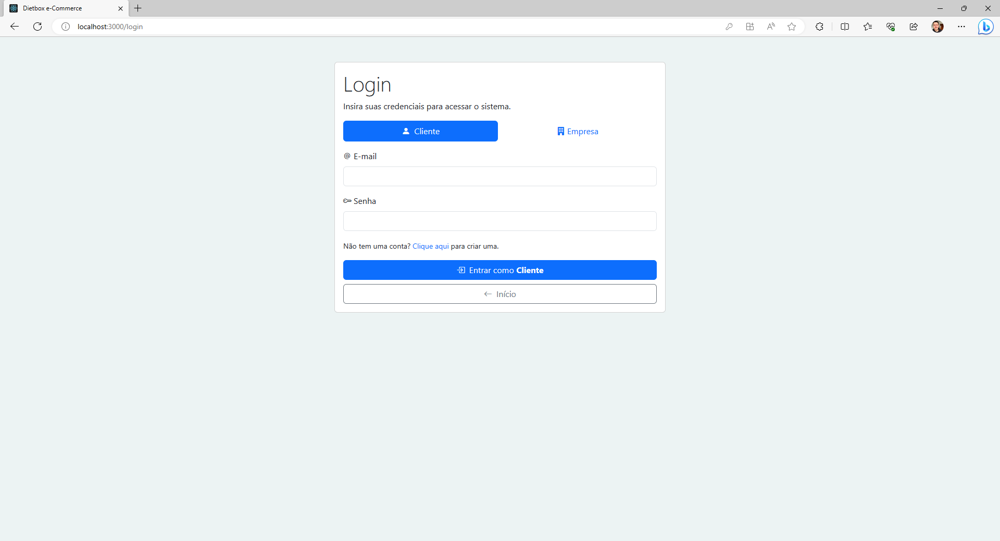
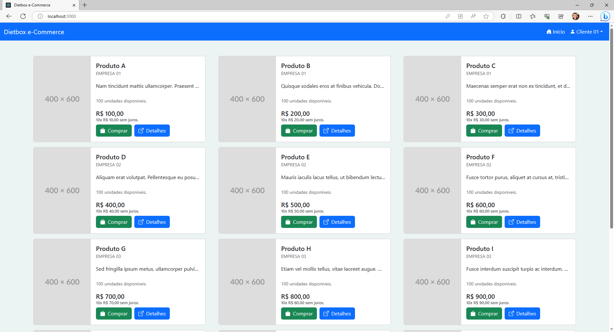
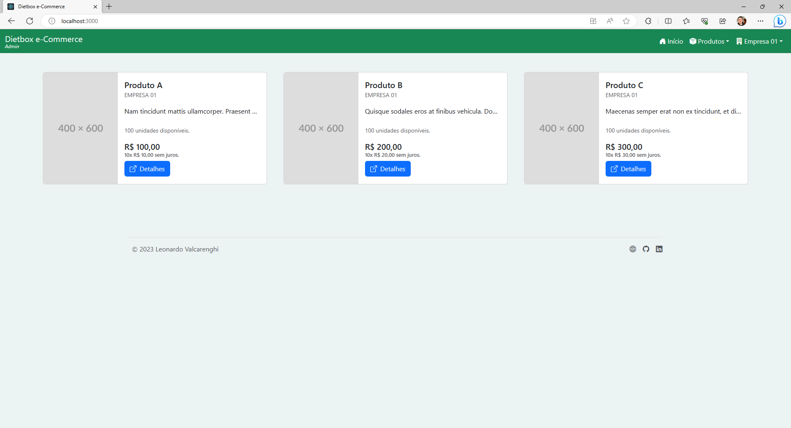
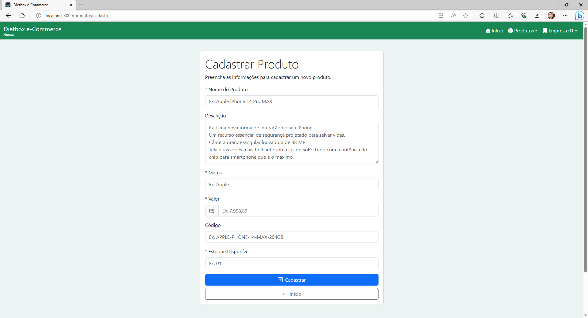
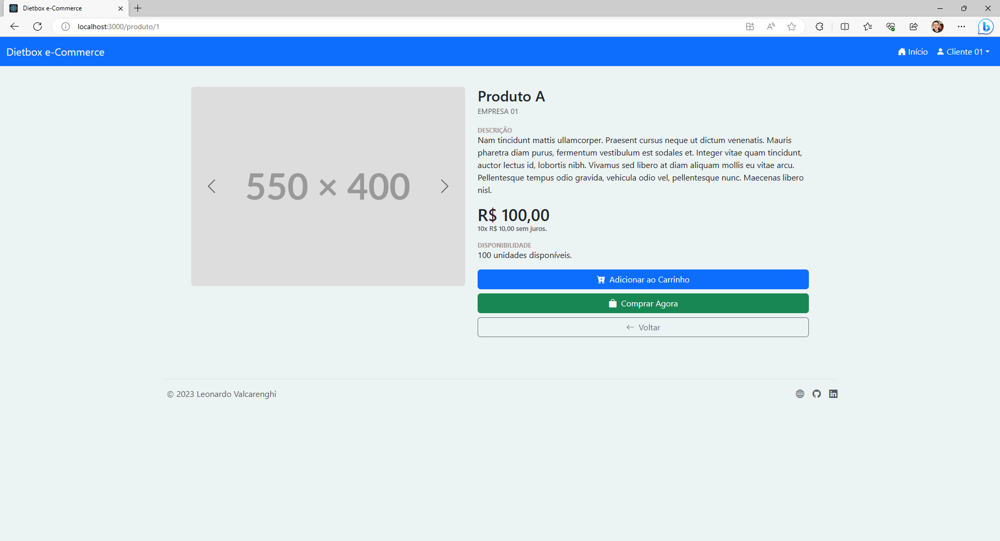
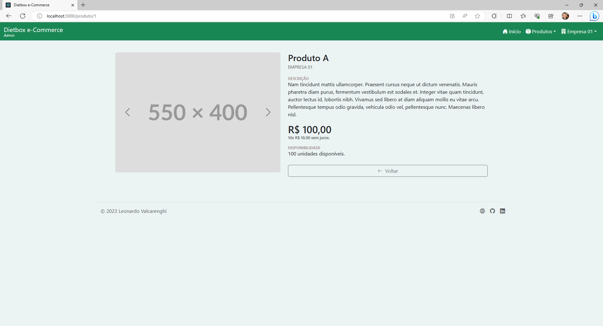

# Dietbox e-Commerce

Desenvolvido por Leonardo Valcarenghi
 
Última atualização: 05/07/2023

## Tecnologias

### **Back-End**

- Microsoft .NET 6
- Entity Framework Core
- AutoMapper
- JWT
- MemoryCache

### **Front-End**

- React
- React Router DOM
- Bootstrap 5.3

### **DataBase**

- SQL Server Express

 

## Configuração

### **Configurando o Banco de Dados**

1. Instale o [_SQL Server Express_](https://www.microsoft.com/pt-br/sql-server/sql-server-downloads) (se necessário) e reinicie o computador.
2. Instale o [_SQL Server Data Tools_](https://learn.microsoft.com/pt-br/sql/ssdt/download-sql-server-data-tools-ssdt?view=sql-server-ver16) (se necessário)  pelo _Visual Studio Installer_.

### **Configurando o Back-End**

1. Abra o projeto no Visual Studio.
2. Instale as dependências do NuGet (se necessárias).
3. Configure a solução para inicializar somente o projeto de **API**.
4. Execute!

> **LOCALHOST** >  
> Certifique-se de que o back-end esteja rodando na porta **3333**.
>   > _Essa é a porta que o front-end está configurado._

 

### **Configurando o Front-End**

### `npm install`

Execute esse comando para instalar todas as dependências do React.

### `npm start`

Após as depedências terem sido instaladas, execute o comando `npm start` para iniciar a aplicação.

 

# Projeto

## Tela de Boas-Vindas

Ao iniciar o **front-end**, você vai se deparar com a tela de boas vindas.
 
Nela contém duas ações, **fazer login** ou **criar conta**.

 

 

## Tela de Criar Conta

Na tela de **criar conta** é possível preencher os dados do **cliente** ou da **empresa** para fazer o devido cadastro e liberar o acesso ao sistema.

 

 

## Tela de Login

Na tela de login você tem a opção de acessar o sistema como **cliente** ou **empresa**.

Alguns clientes e empresas já estão criados para fins de teste. Se quiser você pode experimentar qualquer um destes:

**Clientes**

- cliente01@email.com
- cliente02@email.com
- cliente03@email.com

**Empresas**

- empresa01@email.com
- empresa02@email.com
- empresa03@email.com
- empresa04@email.com
- empresa05@email.com

A senha para qualquer um destes e-mails é **123456789**.

 

 

## Tela de Início

A tela de início _(depois de autenticado)_ é a tela que vai exibir os produtos cadastrados, porém dependendo do tipo de _entidade_ logada, a tela tem um padrão diferente.

### Autenticado como **cliente**:
- Todos os **produtos** de todas as empresas serão listados.
- Permite **comprar** os produtos.
- Barra de **navegação** fica **azul**.

 

### Autenticado como **empresa**:
- Apenas produtos criados pela empresa autenticada serão mostrados.
- Legenda de _Admin_ é exibido.
- Menu de **Produtos** fica disponível na barra de navegação.
- Barra de **navegação** fica na cor **verde**.

 

 

## Tela de Cadastrar de Produto

Esta é a tela onde a empresa vai cadastrar seus **produtos** para ficar disponível para compra pelos clientes.

 

 

## Tela de Visualização do Produto

Esta tela é onde o cliente pode ver mais **detalhes** sobre o **produto**.

> Note que se autenticado como **empresa** o botão de **comprar agora** e **adicionar ao carrinho** _(botão sem ação implementada)_  não aparece.